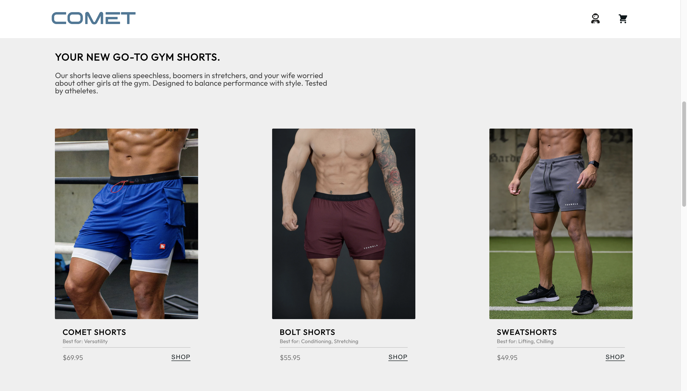
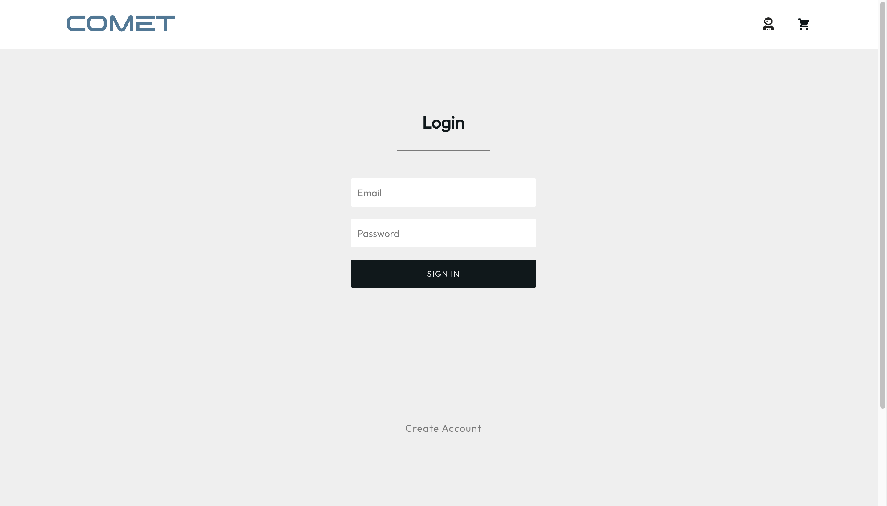
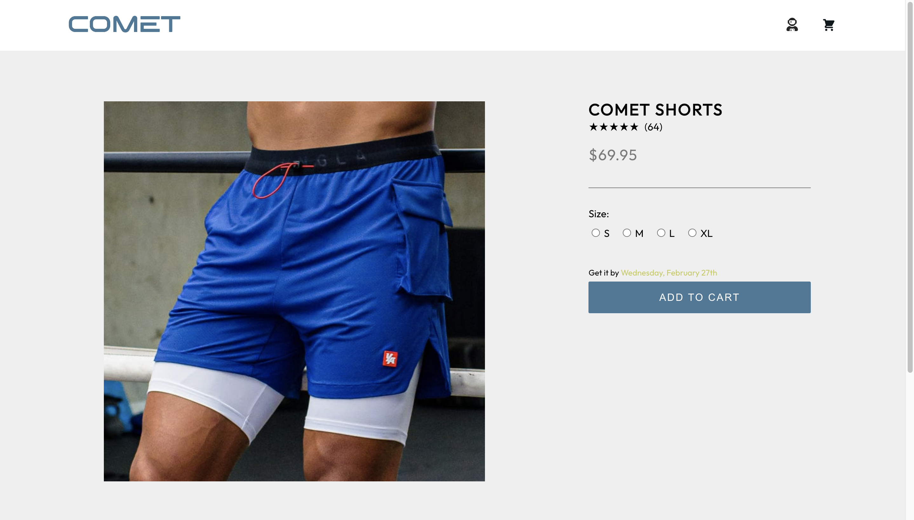
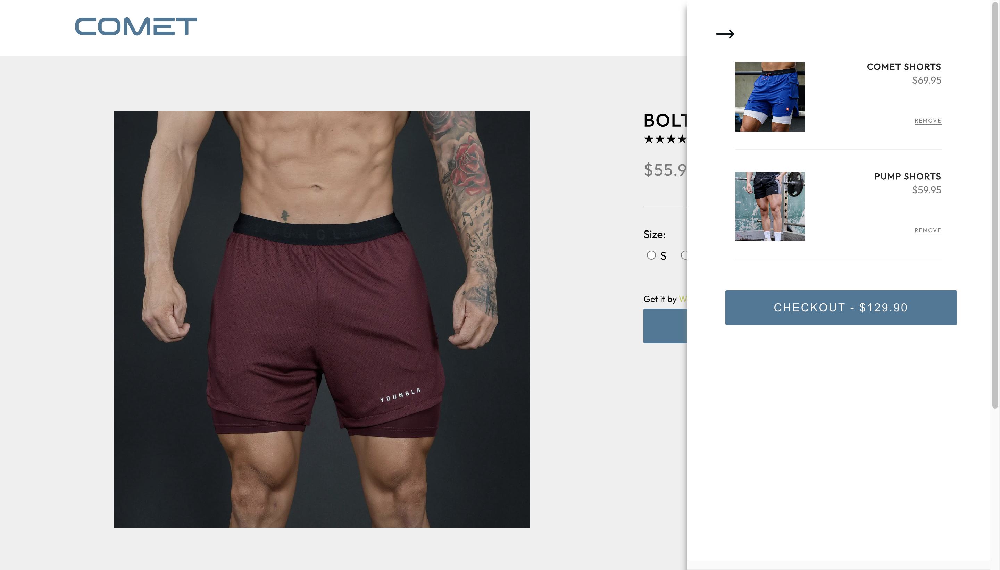

Comet - eCommerce App
======

[Try the App](https://cometproject.herokuapp.com/)

[Watch a Demo](https://vimeo.com/790966087)

[Learn more about the developer](www.linkedin.com/in/cameron-miner-professional/)

***

### Tech Stack

* React
* Node.js
* Express
* PostgreSQL

Users can shop for the greatest gym shorts in the galaxy. An authentication system uses bcrypt and jwt to securely login users and persist the logged in state for 24 hours. Users can view shorts on the homepage, access further details and add shorts to their cart. The cart can be viewed from anywhere in the app, where users can remove items they no longer wish to buy, and checkout when ready.

